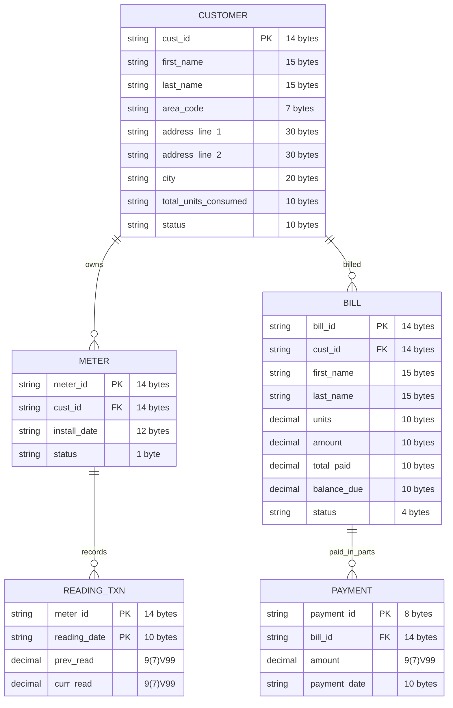

# Electricity Billing System

[]()
[]()
[]()
[]()
[]()

Mainframe-style batch processing system for electricity billing using **COBOL**, **JCL**, and **DB2**.

## Quick Start

This project simulates an electricity board's billing system with:
- Customer and meter management
- Bill generation from meter readings  
- Payment processing
- Analytics and reporting

## Folder Structure

```
Electricity/
├── cobol/                      # VSAM version COBOL programs
│   ├── elect001.cobol          # Customer data load program
│   ├── billpay.cobol           # Bill payment processing program
│   ├── arearpt.cobol           # Area-wise consumption report
│   ├── highcons.cobol          # High consumption alert report
│   └── meter_txn.cobol         # Meter transaction processor
│
├── db2/                        # DB2 integrated COBOL programs
│   ├── electdb2.cobol          # Customer load to DB2
│   ├── meterdb2.cobol          # Meter load to DB2
│   ├── billpaydb2.cobol        # Payment processing with DB2
│   ├── arearptdb2.cobol        # Area report using DB2
│   ├── highconsdb2.cobol       # High consumption report using DB2
│   └── jcl/                    # DB2 execution guides
│       ├── 01-electdb2-guide.md
│       ├── 02-meterdb2-guide.md
│       ├── 03-arearptdb2-guide.md
│       ├── 04-highconsdb2-guide.md
│       └── 05-billpaydb2-guide.md
│
├── jcl/                        # JCL job scripts (VSAM version)
│   ├── runjcl01.txt            # Main execution JCL
│   ├── runbillpay.txt          # Bill payment JCL
│   ├── runarearpt.txt          # Area report JCL
│   └── runhighcons.txt         # High consumption JCL
│
├── data/                       # Sample input data files
│   ├── customer_fixed_200.txt  # Customer test data
│   ├── meter_input_200.txt     # Meter test data
│   ├── billdata.txt            # Sample billing data
│   └── payment.txt             # Sample payment data
│
├── ksds/                       # VSAM KSDS datasets
│   └── customer                # Customer VSAM dataset
│
├── python/                     # Data generation utilities
│   ├── customer_gen.py         # Generate customer test data
│   ├── meter_gen.py            # Generate meter test data
│   └── meter_txn.py            # Generate transaction data
│
├── docs/                       # Documentation
│   ├── project-overview.md     # Detailed architecture and data model
│   ├── guides/                 # Setup and how-to guides
│   │   ├── working with db2.md
│   │   ├── DB2_INTEGRATION.md
│   │   ├── DB2_MIGRATION_GUIDE.md
│   │   └── transfer-data-to-db2/   # PDS to DB2 utilities
│   │       ├── README.md
│   │       └── jcl/
│   │           ├── pds-to-db2.jcl
│   │           └── db2-to-pds.jcl
│   └── migration/              # Migration documentation
│       ├── DB2_ELECTDB2_CHANGES.md
│       ├── DB2_METERDB2_CHANGES.md
│       ├── DB2_AREARPTDB2_CHANGES.md
│       ├── DB2_BILLPAYDB2_CHANGES.md
│       └── DB2_HIGHCONSDB2_CHANGES.md
│
├── src/                        # Source text files
│   ├── billgen.txt
│   ├── elect001.txt
│   ├── arearpt.txt
│   └── arearpt.txt
│
└── readme.md                   # This file
```

## Data Model



## Key Components

| Component | Description |
|-----------|-------------|
| **VSAM Version** | Sequential/VSAM file processing (`cobol/`, `jcl/`) |
| **DB2 Version** | Database-backed processing (`db2/`) |
| **Data Generator** | Python scripts to create test data (`python/`) |

## Data Flow

```
CUSTOMER (Master) → METER (Master) → READING_TXN (Input)
                                            ↓
                                      BILLGEN → BILL (Output)
                                            ↓
                                      PAYMENT → BILL_UPDATE
                                            ↓
                                      Reports (Area, High Consumption, Payment Status)
```

## Getting Started

1. **Generate Test Data**: Use `python/customer_gen.py` and `python/meter_gen.py`
2. **Run VSAM Version**: Submit JCL from `jcl/` folder
3. **Run DB2 Version**: Follow guides in `db2/jcl/` folder

## Documentation

- [Project Overview](docs/project-overview.md) - Detailed architecture and data model
- [DB2 Setup Guide](docs/guides/working%20with%20db2.md) - DB2 configuration and setup
- [DB2 Integration](docs/guides/DB2_INTEGRATION.md) - DB2 program integration details
- [Data Transfer to DB2](docs/guides/transfer-data-to-db2/) - PDS to DB2 utilities

## Datasets

| Dataset | Type | Description |
|---------|------|-------------|
| CUSTOMER | Master | Customer records (146 bytes) |
| METER | Master | Meter records (41 bytes) |
| READING_TXN | Transaction | Meter readings (29 bytes) |
| BILL | Derived | Generated bills |
| PAYMENT | Transaction | Payment records |

## Reports Generated

1. **Area-wise Consumption Report** - Consumption by geographic area
2. **High Consumption Report** - Top 5 highest consuming customers
3. **Bill Payment Status Report** - Payment tracking with status (Due/Partial/Paid)

## Technologies

- COBOL (batch programs)
- JCL (job control)
- VSAM (virtual storage)
- DB2 (relational database)
- Python (data generation)

## License

Capstone Project - Educational Use
